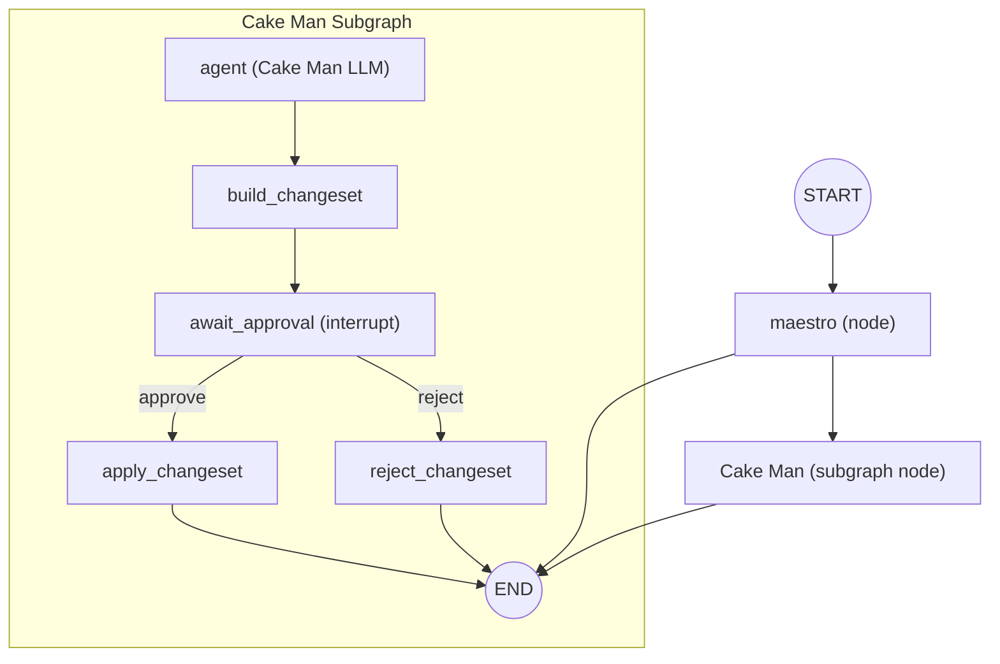

# Agent Graph Map (Current)

| Version | Date | Notes |
| --- | --- | --- |
| v1.1 | 2026-02-04 | Added state update inventory and versioning table. |
| v1.0 | 2026-02-04 | Initial full graph map with nodes, LLM calls, tools, and flows. |

## Graph Inventory (All Nodes and Edges)

### Top-level graph (`backend/src/app/agents/main.py`)
- Nodes
  - `maestro` (wrapped by `persist_messages_wrapper`)
  - `Cake Man` (subgraph node from `cake_man.build_subgraph()`)
- Edges
  - `START -> maestro`
  - `maestro -> END`
  - `maestro -> Cake Man`
  - `Cake Man -> END`

### Cake Man subgraph (`backend/src/app/agents/defintions/cake_man.py`)
- Nodes
  - `agent` (LLM agent created by `create_agent`)
  - `build_changeset`
  - `await_approval`
  - `apply_changeset`
  - `reject_changeset`
- Edges
  - `agent -> build_changeset`
  - `build_changeset -> await_approval`
  - `apply_changeset -> END`
  - `reject_changeset -> END`
- Dynamic transitions (not explicit edges; come from `Command`)
  - `await_approval` returns `Command(goto="apply_changeset")` on approval
  - `await_approval` returns `Command(goto="reject_changeset")` on rejection
  - `propose_edits` tool returns `Command(goto="build_changeset")`

## Every LLM Call (Explicit in Code)

### Maestro node (`backend/src/app/agents/defintions/maestro.py`)
1. `ChatOpenAI(model="gpt-5.2").invoke(...)`
   - Purpose: produce the Maestro reply content.
2. `ChatOpenAI(model="gpt-5.2").with_structured_output(...).invoke(...)`
   - Purpose: classify the Maestro reply into an action (text vs. goto sub-agent).

### Cake Man agent node (`backend/src/app/agents/defintions/cake_man.py`)
- `create_agent("gpt-5.2", tools=[propose_edits, read_docs], middleware=[dynamic_prompt(...)])`
  - This node is the Cake Man LLM call site.
  - The exact number of LLM turns per run is controlled by LangChain's agent loop defaults (not configured here).
  - Tool calls (`read_docs`, `propose_edits`) do not themselves call LLMs.

### LLM imports present but unused
- `ChatAnthropic` is imported in `maestro.py` and `cake_man.py` but not used.

## Tools and Their Effects (All Tool Calls)

### `read_docs` tool (`backend/src/app/agents/tools/read_docs.py`)
- Input: list of `doc_ids`
- Output: full doc content subset from state
- No side effects other than returning data

### `propose_edits` tool (`backend/src/app/agents/tools/propose_edits.py`)
- Validates doc IDs exist
- Emits `agent.proposed_edits` event
- Returns `Command` with:
  - `update`: `proposed_edits`, `proposal_summary`, `proposal_by`, and a `ToolMessage`
  - `goto="build_changeset"` to continue the subgraph flow

## Change Set Flow (All Nodes and Side Effects)

### `build_changeset`
- Converts `proposed_edits` into a `ChangeSet`
- Builds unified diffs per doc
- Emits `changeset.created`
- Updates state:
  - `pending_change_set`
  - clears `proposed_edits`, `proposal_summary`, `proposal_by`

### `await_approval`
- Emits an interrupt with the pending change set summary + diffs
- On approval:
  - Emits `changeset.approved`
  - Returns `Command(goto="apply_changeset")`
- On rejection:
  - Emits `changeset.rejected`
  - Returns `Command(goto="reject_changeset")`

### `apply_changeset`
- Applies the edits to `docs` with updated timestamps and `updated_by`
- Emits `changeset.applied`
- Clears `pending_change_set`

### `reject_changeset`
- Emits `changeset.discarded`
- Clears `pending_change_set`

## State Shape (All Fields in `AgentState`)

From `backend/src/app/agents/state/types.py`:
- `thread_id`
- `messages` (LangGraph reducer `add_messages`)
- `history` (append reducer)
- `docs` (merge reducer by doc_id)
- `docs_summary` (merge reducer)
- `proposed_edits` (append reducer)
- `proposal_summary`
- `proposal_by`
- `pending_change_set` (last-write-wins)

## All State Updates (By Node / Tool)

### `get_initial_state_update` (`backend/src/app/agents/state/get_initial_state_update.py`)
- Always sets:
  - `thread_id`
  - `messages` (initial `HumanMessage`)
  - `proposed_edits` (empty list)
  - `proposal_summary` (empty string)
  - `proposal_by` (empty string)
  - `pending_change_set` (`None`)
- If `is_new_thread`:
  - `docs` (initialized from `state/docs.py`)
  - `docs_summary` (all doc ids set to `"no content yet"`)

### `maestro` node (`backend/src/app/agents/defintions/maestro.py`)
- Always returns a state update containing:
  - `messages`: a new `AIMessage` (the Maestro reply)
  - `by_agent`: `"maestro"` (used by `persist_messages_wrapper` to tag persistence)
- If routing to sub-agent:
  - Returns `Command(goto=<subagent_name>, update=<state_update_above>)`

### `read_docs` tool (`backend/src/app/agents/tools/read_docs.py`)
- Returns a subset of `docs` content
- Does not mutate or update state

### `propose_edits` tool (`backend/src/app/agents/tools/propose_edits.py`)
- Validates doc ids against `docs`
- Emits `agent.proposed_edits`
- Returns `Command` that updates:
  - `proposed_edits` (full list of new proposed edits)
  - `proposal_summary`
  - `proposal_by`
  - `messages` (a `ToolMessage` acknowledging success)
- Also returns `goto="build_changeset"`

### `build_changeset` node (`backend/src/app/agents/nodes/change_set.py`)
- If `proposed_edits` is empty:
  - Returns `{}` (no state update)
- Otherwise updates:
  - `pending_change_set` (new `ChangeSet` with diffs and metadata)
  - `proposed_edits` (cleared to `[]`)
  - `proposal_summary` (cleared to `""`)
  - `proposal_by` (cleared to `""`)

### `await_approval` node (`backend/src/app/agents/nodes/change_set.py`)
- If no pending change set or not `"pending"`:
  - Returns `{}` (no state update)
- Otherwise:
  - Emits an interrupt payload containing the change set summary/diffs
  - On approval: `Command(goto="apply_changeset")` (no direct state fields updated here)
  - On rejection: `Command(goto="reject_changeset")` (no direct state fields updated here)

### `apply_changeset` node (`backend/src/app/agents/nodes/change_set.py`)
- If no pending change set:
  - Returns `{}` (no state update)
- Otherwise updates:
  - `docs` (merged; content replaced for edited docs, `updated_by` + `updated_at` set)
  - `pending_change_set` (cleared to `None`)

### `reject_changeset` node (`backend/src/app/agents/nodes/change_set.py`)
- Updates:
  - `pending_change_set` (cleared to `None`)

## Persistence and Streaming

### Message persistence (`backend/src/app/db/persist_messages_wrapper.py`)
- Only the `maestro` node is wrapped to persist messages to Postgres.
- The Cake Man subgraph is currently not wrapped (comment notes "removed persistence").

### Checkpointing
- `PostgresSaver` is used when compiling the graph in `backend/src/app/routes/chat.py`.
- The graph runs with `stream_mode=["messages", "updates", "custom"]`.

### Custom stream events (all emitters)
- `emit_event` writes custom stream chunks for:
  - `agent.proposed_edits`
  - `changeset.created`
  - `changeset.approved`
  - `changeset.rejected`
  - `changeset.applied`
  - `changeset.discarded`

## Current Agent Roster in Code (Wired)

Defined and wired:
- `maestro` (orchestrator)
- `Cake Man` (sub-agent)

Not wired in code (even though described in docs):
- Devil's Advocate (Damien)
- Angel Eyes (Grace)
- Capital Freak (Max)
- Buzz (Zara)
- Mr. T (Tomas)

## Entry and Approval Endpoints (Graph Entry Points)

### `POST /api/chat/{thread_id}`
- Creates a new thread ID (currently always new)
- Initializes state via `get_initial_state_update`
- Runs `graph.stream(...)` until completion or interrupt

### `POST /api/chat/{thread_id}/approval`
- Resumes the graph with `Command(resume={"decision": ...})`
- Continues from the interrupt in `await_approval`
