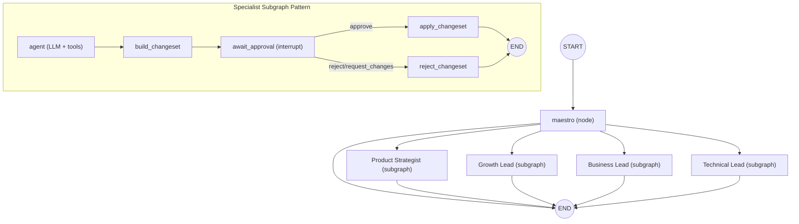

# Agent Graph Map (Current)

| Version | Date | Notes |
| --- | --- | --- |
| v2.0 | 2026-02-09 | Updated roster to 4 specialists and refreshed living-document model. |

## Top-Level Workflow
Source: `backend/src/app/agents/build_workflow.py`

- Entry: `START -> maestro`
- Maestro routes to one of:
  - `Product Strategist`
  - `Growth Lead`
  - `Business Lead`
  - `Technical Lead`
- If no routing target is selected, graph exits to `END`.

## Specialist Subgraph Pattern
Source examples:
- `backend/src/app/agents/defintions/product_strategist.py`
- `backend/src/app/agents/defintions/growth_lead.py`
- `backend/src/app/agents/defintions/business_lead.py`
- `backend/src/app/agents/defintions/technical_lead.py`

Each specialist uses the same node pattern:
- `agent` (LLM agent created by `create_agent`)
- `build_changeset`
- `await_approval` (LangGraph interrupt)
- `apply_changeset`
- `reject_changeset`

## Tooling Used By Specialists
- `stage_edits`: stage full document updates into state and jump to `build_changeset`
- `read_docs`: read current document content from state
- `search_web`: external web lookup for current/reference information

## Living Documents (Current Baseline)
Source: `backend/src/app/agents/state/empty_docs.py`

- `product_brief`
- `evidence_assumptions_log`
- `mvp_scope_non_goals`
- `technical_plan`
- `gtm_plan`
- `business_model_pricing`
- `risk_decision_log`
- `next_actions_board`

## Streaming and Persistence
- Graph stream mode: `messages`, `updates`, `custom`
- API stream adapter emits normalized SSE events:
  - run lifecycle (`run.started`, `run.completed`, `run.error`)
  - agent lifecycle (`agent.status`)
  - message lifecycle (`message.delta`, `message.completed`)
  - tool lifecycle (`tool.call`, `tool.result`)
  - review lifecycle (`changeset.*`, `approval.required`)
- Endpoints:
  - `POST /api/chat/{thread_id}` starts a chat-triggered run
  - `POST /api/chat/{thread_id}/approval` resumes an interrupted run with user decision
  - `GET /api/chat/{thread_id}` returns thread snapshot for hydration/recovery

## Known Constraints
- Current orchestration remains single-hop per run (`maestro -> one specialist -> end`), with approval gates inside specialist subgraphs.
- Message persistence is still strongest at orchestrator-level output; Phase 3.1 cleanup tracks full specialist-message durability as a P0 issue.
