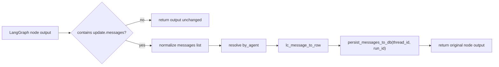

# Tech Spec: Phase 3.1 - 4.1 Graph-Wide Message Persistence Adapter

Last updated: 2026-02-09
Status: Draft
Owner: Engineering
Depends on: `/Users/rajpulapakura/Personal Code/idea-maestro/docs/technical/phase-3.1-cleanup-prd.md`

## 1) Scope
Implement a graph-wide persistence adapter so **all agent messages surfaced to users are durably stored** and available in thread snapshots after refresh/reload.

This spec covers backend runtime and persistence behavior only. It does not change frontend UX behavior directly.

## 2) Problem Statement
Today, persistence is node-local and only applied at the orchestrator level (`maestro`). Specialist/sub-agent messages may stream to the client but are not guaranteed to be persisted through the same path. This creates history gaps and weakens auditability.

Current implementation references:
- `/Users/rajpulapakura/Personal Code/idea-maestro/backend/src/app/db/persist_messages_wrapper.py`
- `/Users/rajpulapakura/Personal Code/idea-maestro/backend/src/app/agents/build_workflow.py`
- `/Users/rajpulapakura/Personal Code/idea-maestro/backend/src/app/routes/chat/streaming.py`

## 3) Goals
- Persist every AI/user/tool message produced by graph execution that is meant to appear in conversation history.
- Ensure consistent `by_agent` attribution for persisted messages.
- Keep ordering deterministic (`seq`) and tied to existing `chat_messages` behavior.
- Avoid duplicate rows for the same logical message.

## 4) Non-Goals
- Redesign of streaming event schema.
- Changes to review/change-set workflow semantics.
- Replacement of snapshot hydration model.

## 5) Requirements

### 5.1 Functional Requirements
1. All agent-originated messages from orchestrator and specialists must be persisted.
2. Tool messages that are part of graph message state must be persisted when they are part of node updates.
3. Persistence must work for both dict node outputs and `Command(update=...)` outputs.
4. Persisted rows must include stable `run_id` and correct `thread_id`.
5. Persisted rows must include correct `by_agent` with no fallback to incorrect agent labels.

### 5.2 Correctness Requirements
1. No duplicate persistence for the same `message_id` + `thread_id`.
2. If a duplicate write is attempted, system should continue without failing the run.
3. Message ordering remains append-only via existing `next_seq` allocator.

### 5.3 Operational Requirements
1. Adapter failures should be observable (structured logging + metrics hook points).
2. Persistence should happen in the request path with bounded overhead.
3. Adapter should be reusable for future workflow changes (4.2 loop refactor).

## 6) Proposed Design

### 6.1 Design Summary
Introduce a **graph-wide node adapter layer** that wraps every graph node capable of returning `messages` in its state update. This adapter extracts messages from node outputs, applies consistent agent attribution, and persists rows through existing repository utilities.

This is a graph-wide pattern, not a single-node special case.

### 6.2 New/Updated Modules

#### A) Replace `persist_messages_wrapper` with generalized adapter
- File to evolve: `/Users/rajpulapakura/Personal Code/idea-maestro/backend/src/app/db/persist_messages_wrapper.py`
- New behavior:
  - Accept explicit `agent_name` override (required for specialist nodes).
  - Accept optional `should_persist` predicate for node-level filtering.
  - Normalize output from dict and `Command(update=...)`.
  - Persist safely with duplicate-tolerant behavior.

Proposed interface:
```python

def persist_messages_adapter(
    node_fn: Callable[[dict[str, Any]], Any],
    *,
    conn_factory: Callable[[], psycopg.Connection],
    agent_name: str | None = None,
    should_persist: Callable[[dict[str, Any], dict[str, Any]], bool] | None = None,
) -> Callable[[dict[str, Any]], Any]:
    ...
```

Attribution rules:
1. `update["by_agent"]` if present and non-empty.
2. `agent_name` from wrapper config.
3. fallback `"agent"`.

#### B) Graph wiring updates
- File: `/Users/rajpulapakura/Personal Code/idea-maestro/backend/src/app/agents/build_workflow.py`
- Change:
  - Keep maestro wrapped.
  - Ensure specialist message-producing node(s) are wrapped by the same adapter.

Implementation approach for specialists:
- Preferred: apply wrapper inside each specialist subgraph builder on `agent` node callable.
- Optional: expose a helper in `BaseSubAgent` to avoid repeated wrapper code.

#### C) Specialist subgraph updates
- Files:
  - `/Users/rajpulapakura/Personal Code/idea-maestro/backend/src/app/agents/defintions/product_strategist.py`
  - `/Users/rajpulapakura/Personal Code/idea-maestro/backend/src/app/agents/defintions/growth_lead.py`
  - `/Users/rajpulapakura/Personal Code/idea-maestro/backend/src/app/agents/defintions/business_lead.py`
  - `/Users/rajpulapakura/Personal Code/idea-maestro/backend/src/app/agents/defintions/technical_lead.py`
- Change:
  - Wrap `agent` runnable with `persist_messages_adapter(..., agent_name=<specialist>)`.

### 6.3 Data Flow



### 6.4 Duplicate Handling Strategy
- Keep database uniqueness constraints as source of truth:
  - `UNIQUE (thread_id, message_id)`
  - `UNIQUE (thread_id, seq)`
- Adapter behavior:
  - If persistence raises unique conflict for message rows, swallow conflict and continue.
  - Any non-conflict database failure should raise and fail run (current behavior), while emitting run error downstream.

### 6.5 Agent Attribution Contract
`by_agent` persisted in `chat_messages` must map to UI labels:
- `maestro`
- `Product Strategist`
- `Growth Lead`
- `Business Lead`
- `Technical Lead`

No `"user"` fallback for AI messages in adapter path.

## 7) Migration Plan

### 7.1 Schema Migration
None required.

### 7.2 Runtime Migration
- Deploy adapter changes behind code path replacement (same module, backward-compatible signature if needed).
- Run canary verification on new threads first.
- Existing threads continue to read old and new persisted rows via current snapshot endpoints.

## 8) Rollout Plan
1. Implement adapter and specialist wrapping.
2. Add targeted backend tests (unit + integration).
3. Smoke test on local thread lifecycle:
   - chat request
   - specialist response
   - refresh snapshot
   - verify specialist messages present in `messages` list.
4. Deploy and monitor for duplicate-write errors and run error regressions.

## 9) Validation Plan

### 9.1 Unit Tests
- Adapter extracts messages from dict output.
- Adapter extracts messages from `Command(update=...)` output.
- Adapter applies explicit `agent_name` attribution when `by_agent` missing.
- Adapter ignores outputs with no messages.

### 9.2 Integration Tests
- End-to-end run where a specialist emits AI content:
  - Assert `chat_messages.by_agent == <specialist>` persisted.
  - Assert snapshot includes specialist message after reload.
- Duplicate write scenario (same message_id) does not crash run.

### 9.3 Regression Tests
- Maestro persistence still works unchanged.
- User message persistence path unaffected.
- Change-set approval flow unaffected.

## 10) Risks and Mitigations
- Risk: Wrapping specialist `agent` runnable may miss messages emitted by nested internals.
  - Mitigation: verify persisted history against stream transcript for representative runs.
- Risk: Duplicate message IDs from provider chunks.
  - Mitigation: rely on `message_id` normalization and DB conflict tolerance.
- Risk: Performance overhead from per-node DB writes.
  - Mitigation: persist only when update includes completed message objects; keep current transaction scope.

## 11) Encountered Issue and Resolution
### Issue observed during implementation
- Symptom: the first user and maestro assistant messages were duplicated in `chat_messages` after a specialist turn.
- Root cause:
  - Specialist adapter persisted `update["messages"]` as a full batch instead of only new messages.
  - That batch included prior conversation context.
  - Historical messages without stable IDs were reinserted with new generated UUIDs, bypassing duplicate detection.
  - Batch-level attribution incorrectly labeled duplicated rows with specialist `by_agent`.

### Resolution implemented
- Added **delta-only persistence** in adapter:
  - Compare `state["messages"]` and `update["messages"]`.
  - Persist only the newly appended suffix.
- Added **per-message attribution** rules:
  - `human` -> `user`
  - `system` -> `system`
  - non-maestro agent outputs -> specialist agent name
  - maestro outputs -> `maestro`
- Removed serializer fallback that defaulted non-user messages to `by_agent = "user"`.

### Outcome
- No duplicate replay of historical context messages.
- Correct attribution contract now holds:
  - Maestro messages attributed to `maestro`
  - User messages attributed to `user`
  - Specialist messages attributed to specialist agent.

## 12) Decisions (Resolved)
1. **Transcript table**: deferred. `chat_messages` remains the sole source of truth in 4.1.
2. **Tool event table**: deferred. `tool.call` / `tool.result` persistence is out of scope for 4.1.

## 13) Implementation Checklist
- [x] Add generalized `persist_messages_adapter` with attribution controls.
- [x] Update workflow/subgraphs to apply adapter graph-wide.
- [x] Add duplicate-safe conflict handling.
- [ ] Add unit tests for adapter behavior.
- [ ] Add integration test covering specialist persistence.
- [ ] Update architecture docs after implementation lands.
