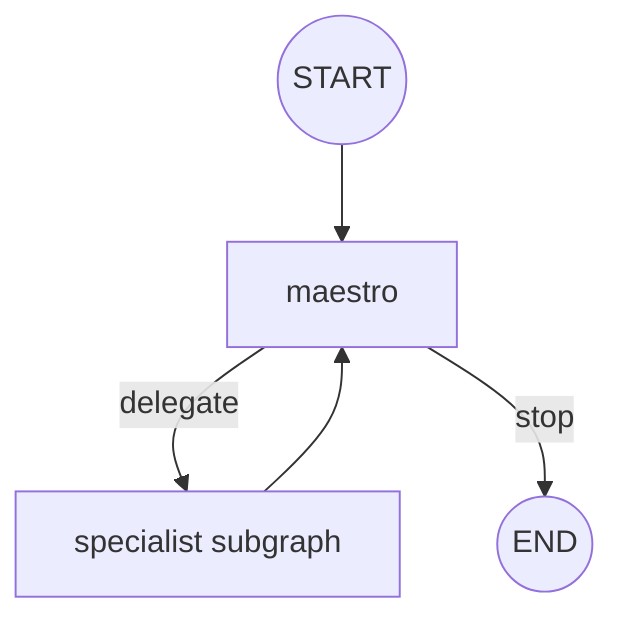

# Tech Spec: Phase 3.1 - 4.2 Single-Supervisor Loop Orchestration

Last updated: 2026-02-10
Status: Draft
Owner: Engineering
Depends on:
- `/Users/rajpulapakura/Personal Code/idea-maestro/docs/technical/phase-3.1-cleanup-prd.md`
- `/Users/rajpulapakura/Personal Code/idea-maestro/docs/technical/phase-3.1-4.1-message-persistence-spec.md`
- `/Users/rajpulapakura/Personal Code/idea-maestro/docs/technical/phase-3.1-4.3-maestro-routing-spec.md`

## 1) Scope
Implement iterative multi-agent orchestration in a single run using a **single-supervisor loop**:
- Maestro decides whether to delegate to one specialist or stop.
- After each specialist turn, control returns to Maestro.
- Repeat until stop condition.

Approval interrupts inside specialist subgraphs remain unchanged.

## 2) Problem Statement
Current top-level flow is single-hop:
- `START -> maestro -> (one specialist or END)`

This limits depth of multi-agent collaboration and forces users to submit additional messages for what should be one orchestrated cycle.

Current workflow reference:
- `/Users/rajpulapakura/Personal Code/idea-maestro/backend/src/app/agents/build_workflow.py`

## 3) Goals
- Support multiple specialist turns in one run.
- Keep orchestration dynamic and LLM-decided.
- Enforce hard safety guardrails to avoid runaway loops.
- Preserve compatibility with 4.1 persistence and 4.3 Maestro structured routing.

## 4) Non-Goals
- Parallel specialist execution.
- Multiple staged edits concurrently.
- Redesign of approval semantics (handled in 4.4 UX work).

## 5) Requirements

### 5.1 Functional
1. Maestro can iterate specialist delegation in one run.
2. Each loop iteration delegates to at most one specialist.
3. Specialist completion returns control to Maestro.
4. Maestro can stop loop explicitly (`action = stop`).
5. Approval-required interruptions still pause run and require resume via approval endpoint.

### 5.2 Reliability and Safety
1. System must enforce max iterations guardrail.
2. Invalid routing decisions must fail closed to stop or safe respond.
3. Repeated invalid/no-op cycles must terminate gracefully.

### 5.3 Compatibility
1. `messages`, `by_agent`, `next_agent` contracts remain valid for 4.1 persistence adapter.
2. Maestro structured decision schema from 4.3 is the routing source of truth.

## 6) Proposed Design

### 6.1 Top-Level Graph Topology
Current:
- `START -> maestro`
- `maestro -> specialist | END`
- `specialist -> END`

Proposed:
- `START -> maestro`
- `maestro -> specialist | END`
- `specialist -> maestro`

This creates iterative control flow while preserving existing specialist subgraphs.

### 6.2 Maestro Decision Contract for 4.2
Extend 4.3 Maestro routing action vocabulary:
- `delegate`
- `respond`
- `stop`

Rules:
- `delegate` requires valid `target_agent`.
- `respond` allows user-facing clarification while keeping run alive if needed.
- `stop` ends run.

For 4.2 implementation simplicity:
- `respond` should set `next_agent = None` and route to END (same as stop) unless explicitly followed by delegate in same decision contract.
- Default stop behavior should be explicit and observable.

### 6.3 State Additions
Add to `AgentState`:
- `iteration_count: int`
- `max_iterations: int`
- `loop_status: str | None` (`running`, `stopped`, `guardrail_stop`)
- `last_routing_error: str | None`

Initialization (`get_initial_state_update`):
- `iteration_count = 0`
- `max_iterations = <configured default>` (proposed default: 4)
- `loop_status = "running"`
- `last_routing_error = None`

### 6.4 Iteration and Guardrail Logic
Each time Maestro delegates to a specialist:
- increment `iteration_count`.

Hard guardrails:
1. `iteration_count >= max_iterations` => force stop (`loop_status = guardrail_stop`).
2. Consecutive invalid delegation targets beyond threshold (proposed 2) => force stop.
3. Consecutive no-op cycles beyond threshold (proposed 2) => force stop.

No-op cycle definition (for 4.2 baseline):
- no changeset created,
- no tool call emitted,
- no new non-empty assistant content emitted.

(Instrumentation for exact no-op detection can begin simple and refine later.)

### 6.5 Approval Interrupt Behavior
No change to specialist approval nodes:
- specialist subgraph can interrupt with `approval.required`.
- run transitions to `waiting_approval`.
- approval endpoint resumes from interrupt.
- after specialist resumes/completes, flow returns to Maestro and loop may continue.

### 6.6 Observability
Add loop lifecycle custom events (recommended):
- `loop.iteration_started` (iteration number, chosen specialist)
- `loop.iteration_stopped` (reason: stop action)
- `loop.guardrail_stop` (reason and threshold)

These are primarily for backend traceability and later UI diagnostics.

## 7) Files to Update
1. `/Users/rajpulapakura/Personal Code/idea-maestro/backend/src/app/agents/build_workflow.py`
- rewire top-level specialist edges from `END` to `maestro`.
- update routing map to include explicit stop/end handling.

2. `/Users/rajpulapakura/Personal Code/idea-maestro/backend/src/app/agents/state/types.py`
- add loop state fields and reducers as needed.

3. `/Users/rajpulapakura/Personal Code/idea-maestro/backend/src/app/agents/state/get_initial_state_update.py`
- initialize new loop state fields.

4. `/Users/rajpulapakura/Personal Code/idea-maestro/backend/src/app/agents/defintions/maestro.py`
- support `stop` action in structured decision.
- enforce guardrails and iteration updates.

5. Optional helper extraction:
- `/Users/rajpulapakura/Personal Code/idea-maestro/backend/src/app/agents/helpers/` for loop guardrail evaluation.

## 8) Migration and Rollout
### 8.1 Migration
- No schema migration required for DB.
- Runtime behavior change only.

### 8.2 Rollout
1. Implement loop with conservative `max_iterations` default (4).
2. Enable loop events/logging.
3. Perform controlled smoke tests with short prompts.
4. Observe run durations and completion behavior before broader use.

## 9) Validation Plan

### 9.1 Unit Tests
- Routing loop returns to Maestro after specialist completion.
- `stop` action exits to END.
- Guardrail max-iterations triggers stop.
- Invalid target handling sets safe stop/respond.

### 9.2 Integration Tests
- One user prompt produces >1 specialist turn in same run.
- Approval interrupt in iteration N pauses and resumes correctly.
- 4.1 persistence remains correct across multiple iterations (no duplicate replay).

### 9.3 Regression Checks
- Single-hop behavior still possible when Maestro chooses immediate stop.
- SSE run lifecycle remains coherent (`run.started` once, `run.completed` once per run).
- Frontend timeline continues to render correctly with expanded run history.

## 10) Risks and Mitigations
- Risk: perceived loop overrun.
  - Mitigation: hard `max_iterations` + explicit stop messaging.
- Risk: repetitive oscillation between same agents.
  - Mitigation: include recent-agent history in Maestro context and discourage repeats unless justified.
- Risk: increased token/runtime cost.
  - Mitigation: conservative guardrails and stop policy.

## 11) Decisions (Resolved)
1. `max_iterations` is a global configuration value for now, set to `4`.
2. No-op detection uses explicit backend state counters (not heuristic-only prompt behavior), with forced stop threshold set to `2` consecutive no-op delegated iterations.

## 12) Implementation Checklist
- [x] Rewire top-level graph for specialist -> maestro loop.
- [x] Add loop state fields and initialization.
- [x] Extend Maestro decision handling for `stop` and guardrails.
- [ ] Add loop lifecycle events/logging.
- [ ] Add unit tests for loop routing and guardrails.
- [ ] Run integration smoke test for iterative multi-agent run.
